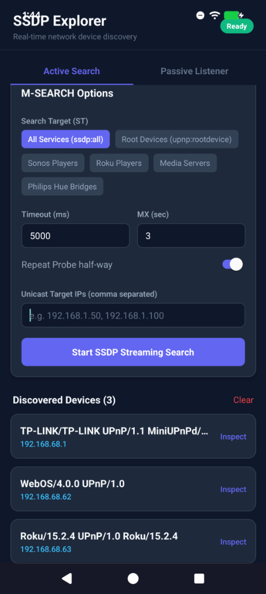
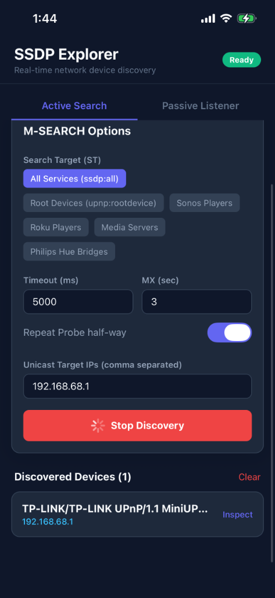

# expo-ssdp

An Expo module for **SSDP (Simple Service Discovery Protocol)** device discovery on local networks. Discover smart TVs, DLNA servers, Chromecast devices, Roku players, Sonos speakers, routers, and any other UPnP/SSDP-capable device from your React Native app.

<p align="center">
  
  &nbsp;
  
</p>

- ✅ **New Architecture ready** — built on Expo Modules Core (Turbo Module via JSI)
- ✅ **iOS and Android** — native UDP multicast on both platforms
- ✅ **Reliable discovery** — sends to both multicast (`239.255.255.250`) and broadcast (`255.255.255.255`) addresses, with an optional second probe burst
- ✅ **Fully typed** — comprehensive TypeScript types and JSDoc for every option and return value
- ✅ **Pre-built search targets** — `SearchTargets` constants for common device categories

---

## Installation

```sh
npm install expo-ssdp
```

### Vanilla React Native Usage (Without Expo)

Yes! `expo-ssdp` is built using the modern **Expo Modules API**, which works seamlessly in **vanilla React Native** projects. You do not need to boot or use the Expo CLI or Expo SDK.

To configure your vanilla React Native project to run Expo Modules, simply run:

```sh
npx install-expo-modules@latest
```

This single command will automatically configure your native Android and iOS folders to support the lightweight Expo Modules compilation layer. Once configured, you can use `expo-ssdp` exactly like any other React Native library.

### Native Installation & Setup

### iOS

```sh
npx pod-install
```

The module depends on [CocoaAsyncSocket](https://github.com/robbiehanson/CocoaAsyncSocket) for robust UDP socket management on iOS. This is installed automatically via CocoaPods.

### Android

No extra steps. The module uses Android's standard `java.net.DatagramSocket` APIs.

### Permissions

#### iOS

On **physical devices (iOS 14+)**, UDP multicast requires two things. **Without both, `search()` silently returns an empty array on real hardware** — the Simulator is unaffected, so this will not surface in development.

**1. Add `NSLocalNetworkUsageDescription` to your app's `Info.plist`:**

```xml
<key>NSLocalNetworkUsageDescription</key>
<string>Used to discover devices on your local network.</string>
```

**2. Request and add the Multicast Networking Entitlement:**

The `com.apple.developer.networking.multicast` entitlement is a **restricted entitlement** that must be requested from Apple:

1. Submit a request at [developer.apple.com/contact/request/networking-multicast](https://developer.apple.com/contact/request/networking-multicast)
2. Once approved, add it to your `.entitlements` file:

```xml
<key>com.apple.developer.networking.multicast</key>
<true/>
```

3. Enable it under **Xcode → Signing & Capabilities → + Capability → Multicast Networking**.
   > **Note:** This entitlement is free but requires Apple approval (typically a few days for legitimate device-discovery use cases).

**Testing Without the Entitlement?**
If you have not yet been approved for the entitlement, iOS will forcefully crash the underlying UDP socket with a "No route to host" error if you attempt to send Multicast or Global Broadcast packets. To test the library on a physical iOS device without the entitlement, you must explicitly disable these probes and use a `unicastTargets` fallback:

```typescript
const devices = await search({
  unicastTargets: ["192.168.1.50"], // Target a specific device IP
  multicastEnabled: false, // Bypasses the Apple Multicast block
  broadcastEnabled: false, // Bypasses the Apple Broadcast block
});
```

_(Note: The iOS Simulator does not enforce this entitlement, so you may also test freely on a Simulator)._

#### Android

No manual steps needed — the library's `AndroidManifest.xml` automatically merges the required permissions into your app:

- `android.permission.INTERNET`
- `android.permission.CHANGE_WIFI_MULTICAST_STATE` (required to enable multicast on Wi-Fi)

---

## Quick Start

```typescript
import { search } from "expo-ssdp";

const devices = await search();

devices.forEach((device) => {
  console.log(device.address); // "192.168.1.42"
  console.log(device.location); // "http://192.168.1.42:1400/xml/device_description.xml"
  console.log(device.usn); // "uuid:550e8400-e29b-41d4-a716-446655440000::upnp:rootdevice"
  console.log(device.server); // "Linux/4.4.0 UPnP/1.1 MiniDLNA/1.3.0"
});
```

---

## API Reference

### `search(options?)`

Performs an active SSDP M-SEARCH on the local network and resolves with a list of discovered devices.

```typescript
import { search, SearchTargets } from "expo-ssdp";

const devices = await search({
  searchTargets: [SearchTargets.MEDIA_RENDERER, SearchTargets.DIAL],
  timeoutMs: 8000,
  mx: 3,
  repeatProbe: true,
});
```

#### Options

| Option             | Type       | Default        | Description                                                                                                                                                |
| ------------------ | ---------- | -------------- | ---------------------------------------------------------------------------------------------------------------------------------------------------------- |
| `searchTargets`    | `string[]` | `["ssdp:all"]` | List of SSDP Search Target (ST) values. Each entry generates a separate M-SEARCH probe.                                                                    |
| `timeoutMs`        | `number`   | `5000`         | Total scan duration in milliseconds. The socket stays open for this duration to collect responses.                                                         |
| `mx`               | `number`   | `3`            | MX (Maximum Wait) header in seconds. Devices may delay their response up to this value. Higher values reduce UDP collisions on busy networks.              |
| `repeatProbe`      | `boolean`  | `true`         | If true, a second probe burst is sent halfway through `timeoutMs`. Improves reliability on lossy or mesh Wi-Fi.                                            |
| `unicastTargets`   | `string[]` | `[]`           | Optional list of device IPv4 addresses to send unicast M-SEARCH packets to in addition to the standard probes. Useful for re-querying a known device.      |
| `multicastEnabled` | `boolean`  | `true`         | Whether to send probes to the UPnP multicast address (`239.255.255.250`). On iOS 14+, requires the `com.apple.developer.networking.multicast` entitlement. |
| `broadcastEnabled` | `boolean`  | `true`         | Whether to send probes to the global broadcast address (`255.255.255.255`). This is a fallback for routers that block multicast.                           |

#### Returns: `Promise<SsdpDevice[]>`

Each device object contains:

| Field      | Type                     | Description                                                                           |
| ---------- | ------------------------ | ------------------------------------------------------------------------------------- |
| `address`  | `string`                 | The IPv4 address of the responding device.                                            |
| `headers`  | `Record<string, string>` | All HTTP-like SSDP response headers (stored with original casing **and** uppercased). |
| `location` | `string?`                | The LOCATION header — typically a URL to the device's UPnP description XML.           |
| `usn`      | `string?`                | The USN (Unique Service Name) — uniquely identifies the device or service.            |
| `st`       | `string?`                | The ST header from the response — indicates the device/service type.                  |
| `server`   | `string?`                | The SERVER header — often contains OS and firmware info.                              |
| `raw`      | `string`                 | The full, unparsed SSDP response string.                                              |

> **Note:** Results are deduplicated by **USN** (Unique Service Name). When using `ssdp:all`, a single physical device may produce **multiple entries** — one per UPnP service it advertises (e.g., `MediaServer`, `ContentDirectory`, `rootdevice`). Use the UUID prefix before `::` in the `usn` field to group entries belonging to the same physical device. When querying a specific ST (e.g., `SearchTargets.MEDIA_SERVER`), each physical device typically appears once.

---

### `SearchTargets`

A set of pre-defined, commonly-used SSDP Search Target strings:

```typescript
import { SearchTargets } from "expo-ssdp";

SearchTargets.ALL; // "ssdp:all" — discover everything
SearchTargets.ROOT_DEVICE; // "upnp:rootdevice"
SearchTargets.MEDIA_RENDERER; // "urn:schemas-upnp-org:device:MediaRenderer:1"
SearchTargets.MEDIA_SERVER; // "urn:schemas-upnp-org:device:MediaServer:1"
SearchTargets.DIAL; // "urn:dial-multiscreen-org:service:dial:1" (Chromecast)
SearchTargets.SAMSUNG_TV; // "urn:samsung.com:service:MultiScreenService:1"
SearchTargets.SAMSUNG_REMOTE; // "urn:samsung.com:device:RemoteControlReceiver:1"
SearchTargets.ROKU; // "urn:roku-com:service:ecp:1"
SearchTargets.SONOS; // "urn:schemas-upnp-org:device:ZonePlayer:1"
SearchTargets.HUE_BRIDGE; // "urn:schemas-upnp-org:device:Basic:1"
SearchTargets.INTERNET_GATEWAY; // "urn:schemas-upnp-org:device:InternetGatewayDevice:1"
```

---

### `getNetworkInterfaces()`

Returns a list of active IPv4 network interface names on the device. Useful for debugging when discovery is not working.

```typescript
import { getNetworkInterfaces } from "expo-ssdp";

const interfaces = await getNetworkInterfaces();
console.log(interfaces); // ["en0"] on iPhone over Wi-Fi
```

---

### `isAvailable`

A boolean indicating whether the native module is loaded. Useful for graceful fallback.

```typescript
import { isAvailable, search } from "expo-ssdp";

if (!isAvailable) {
  console.warn("SSDP not available on this platform/build.");
  return;
}

const devices = await search();
```

---

---

## Examples

For a complete, interactive, high-performance explorer application showcasing all features (with dark mode and detailed header inspection), check out the [example app](./example).

### Real-Time Streaming Discovery

Use `searchStream` (an `AsyncGenerator`) to yield devices as they are found, which makes your user interface feel extremely responsive:

```typescript
import { searchStream } from "expo-ssdp";

const stream = searchStream({ timeoutMs: 8000 });

try {
  for await (const device of stream) {
    console.log("Discovered:", device.address, "-", device.server);
    // Update React state or UI list immediately!
  }
  console.log("Search complete!");
} catch (err) {
  console.error("Search failed:", err);
}
```

To cancel an active stream early (e.g., when a user unmounts the component or presses a "Cancel" button), call `stream.return(undefined)`. This immediately halts the native search, closes the socket, and resolves the generator:

```typescript
// Call this when you want to stop discovery:
await stream.return(undefined);
```

### Passive Live Monitoring

Instead of active querying, listen for unsolicited `NOTIFY` announcements sent by devices to automatically detect when they join (`ssdp:alive`) or leave (`ssdp:byebye`) the network:

```typescript
import { listenForNotifications } from "expo-ssdp";

const subscription = listenForNotifications({
  onAlive: (event) => {
    console.log("Device online:", event.address, "USN:", event.usn);
  },
  onByeBye: (event) => {
    console.log("Device offline:", event.address, "USN:", event.usn);
  },
  onUpdate: (event) => {
    console.log("Device status changed:", event.address);
  },
  onError: (error) => {
    console.error("Notification socket error:", error);
  },
});

// Later, stop listening to free network sockets:
subscription.remove();
```

### Unicast M-SEARCH

Directly target specific device IPs to verify their status or bypass routers that completely block multicast and broadcast packets:

```typescript
import { search } from "expo-ssdp";

const devices = await search({
  unicastTargets: ["192.168.1.50", "192.168.1.100"],
  timeoutMs: 3000,
});
```

### Fetch UPnP Device Details

After discovering a device with a `location` URL, fetch its UPnP description XML to parse the friendly model name, manufacturer, and nested services:

```typescript
const devices = await search({ searchTargets: [SearchTargets.ROOT_DEVICE] });

for (const device of devices) {
  if (device.location) {
    const response = await fetch(device.location);
    const xml = await response.text();
    console.log(`Device at ${device.address}:`, xml);
  }
}
```

---

## How SSDP Works

SSDP (Simple Service Discovery Protocol) is a UDP-based protocol defined as part of UPnP/DLNA. When you call `search()`, the module:

1. **Opens a UDP socket** and enables multicast and broadcast.
2. **Sends M-SEARCH packets** to both:
   - The SSDP multicast group: `239.255.255.250:1900`
   - The broadcast address: `255.255.255.255:1900` _(fallback for routers that block multicast)_
3. **Waits** for devices to respond (up to `timeoutMs` ms).
4. **Deduplicates** responses by **USN** (Unique Service Name) — each unique `USN` header value is one entry. A single physical device may return multiple entries when using `ssdp:all` (one per UPnP service). Fall back to IP address when no USN is present.
5. **Optionally re-probes** halfway through the timeout window to catch devices that missed the first probe (UDP is lossy).

### Why both multicast AND broadcast?

Many modern consumer routers and mesh systems drop or mishandle multicast traffic. The broadcast fallback ensures discovery still works on these networks.

### What is `mx`?

The `MX` header tells devices how long they may wait (in seconds) before sending their response. Without `MX`, every device on the network would respond instantly, flooding your UDP socket and causing packet loss. A reasonable `MX: 3` spreads 20 devices' responses over 3 seconds, greatly reducing collisions.

---

## Troubleshooting

**No devices found:**

- Ensure your phone is on the same Wi-Fi network as the target devices.
- Try increasing `timeoutMs` to `10000` or `15000`.
- Check that `CHANGE_WIFI_MULTICAST_STATE` is in your Android manifest.
- Call `getNetworkInterfaces()` to verify the device has an active Wi-Fi interface.
- Some corporate/enterprise Wi-Fi networks block multicast/broadcast entirely.

**Partial results:**

- Enable `repeatProbe: true` (the default) to catch devices that missed the first probe.
- Some devices only respond to specific `ST` values — try multiple `searchTargets` including `"ssdp:all"`.

**Different results on iOS vs Android:**

- Both iOS and Android join multicast groups on every active non-loopback IPv4 interface. Results may still differ if the set of active interfaces differs (e.g., one platform has a VPN adapter active that the other does not).

---

## Supporting this Project & Contributing

This library was created and open-sourced to fulfill a critical need for robust, real-time local network device discovery in my own projects. Since SSDP and UPnP protocols are subject to endless variations in consumer smart hardware and OS sandboxing updates, this project is provided as a gift to the React Native and Expo communities.

I warmly invite and welcome the community to help support, maintain, and expand this library! Whether you are:

- Testing with unique hardware configurations (Smart TVs, AV Receivers, IoT hubs, speakers)
- Optimizing network-interface bindings or migrating underlying native sockets
- Submitting issue reports, fixing bugs, or improving this documentation

Please feel free to open a Pull Request, submit an issue, or suggest enhancements. Let's build the ultimate local network explorer together!

---

## License

MIT
